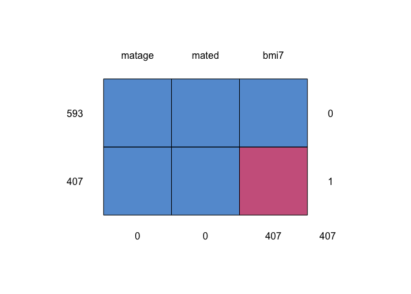
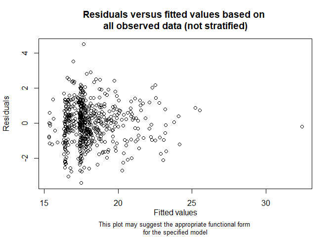
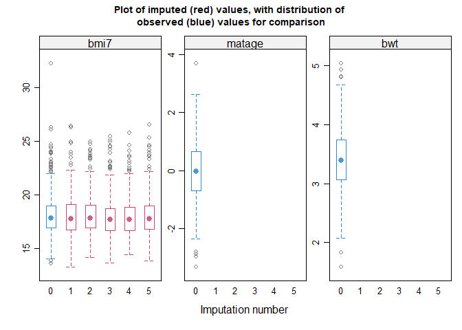
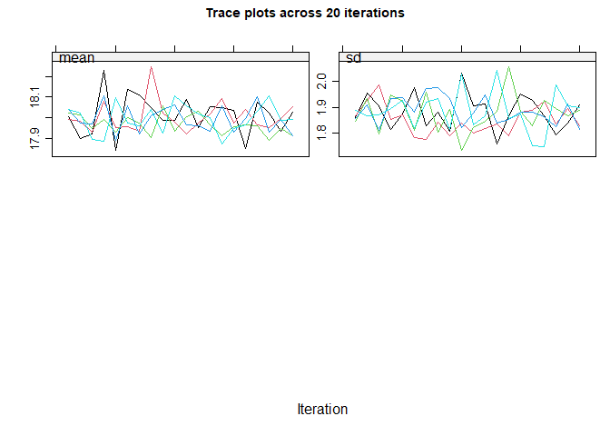

<!-- README.md is generated from README.Rmd. Please edit that file -->

# midoc

<!-- badges: start -->

[](https://github.com/elliecurnow/midoc/actions/workflows/R-CMD-check.yaml)
[](https://CRAN.R-project.org/package=midoc)
<!-- badges: end -->

## Overview

The Multiple Imputation DOCtor (`midoc`) R package is a guidance system
for analysis with missing data. It incorporates expert, up-to-date
methodology to help you choose the most appropriate analysis method when
there are missing data. By examining the available data and the assumed
causal structure, `midoc` will advise whether multiple imputation is
needed, and if so, how best to perform it.

- `descMissData` lists missing data patterns in the specified dataset

- `exploreDAG` compares the relationships in the available data with the
  proposed DAG

- `checkCRA` checks complete records analysis is valid under the
  proposed analysis model

- `checkMI` checks multiple imputation is valid under the proposed
  imputation model

- `checkModSpec` explores the parametric specification of the imputation
  model

- `proposeMI` suggests multiple imputation options based on the
  available data and specified imputation model

- `doMImice` performs multiple imputation based on the `proposeMI`
  options

You can learn more about these commands in `vignette("midoc","midoc")`.

## Installation

You can install the latest release of midoc from CRAN with:

``` r
install.packages('midoc')
```

You can install the development version of midoc from
[GitHub](https://github.com/) with:

``` r
# install.packages("remotes")
remotes::install_github("elliecurnow/midoc")
```

## Usage

``` r
library(midoc)

head(bmi)
#>       bmi7      matage mated pregsize      bwt r
#> 1 19.66831  1.44983969     1        0 3.343531 1
#> 2 17.29852  0.64876278     1        0 3.779987 1
#> 3       NA -1.17814075     0        1 3.070305 0
#> 4       NA -0.93278538     1        0 3.100346 0
#> 5 17.94447 -0.02145515     1        0 3.738823 1
#> 6       NA -0.50127096     0        0 2.769860 0

descMissData(y="bmi7", covs="matage mated", data=bmi, plot=TRUE)
```



    #> [[1]]
    #>      pattern bmi7 matage mated   n pct
    #> [1,]       1    1      1     1 593  59
    #> [2,]       2    0      1     1 407  41

    exploreDAG(mdag=" matage -> bmi7 
                      mated -> matage 
                      mated -> bmi7 
                      sep_unmeas -> mated 
                      sep_unmeas -> r
                      pregsize -> bmi7 
                      pregsize -> bwt  
                      sep_unmeas -> bwt", 
               data=bmi)
    #> The proposed directed acyclic graph (DAG) implies the following pairs
    #> of variables are (conditionally) independent (where, for example, 'X
    #> _||_ Y | Z' should be read as 'X is independent of Y conditional on
    #> Z'). Note that variable names are abbreviated. Consider whether these
    #> (conditional) independencies are plausible for your study, and update
    #> your DAG accordingly:
    #> 
    #> bmi7 _||_ bwt | prgs, sp_n
    #> 
    #> bmi7 _||_ bwt | matd, prgs
    #> 
    #> bmi7 _||_ r | sp_n
    #> 
    #> bmi7 _||_ r | matd
    #> 
    #> bmi7 _||_ sp_n | matd
    #> 
    #> bwt _||_ matg | matd
    #> 
    #> bwt _||_ matg | sp_n
    #> 
    #> bwt _||_ matd | sp_n
    #> 
    #> bwt _||_ r | sp_n
    #> 
    #> matg _||_ prgs
    #> 
    #> matg _||_ r | sp_n
    #> 
    #> matg _||_ r | matd
    #> 
    #> matg _||_ sp_n | matd
    #> 
    #> matd _||_ prgs
    #> 
    #> matd _||_ r | sp_n
    #> 
    #> prgs _||_ r
    #> 
    #> prgs _||_ sp_n
    #> 
    #> These (conditional) independence statements are explored below using
    #> the canonical correlations approach for mixed data. See
    #> ??dagitty::localTests for further details.  Results are shown for
    #> variables that are fully observed in the specified dataset. The null
    #> hypothesis is that the stated variables are (conditionally)
    #> independent.
    #> 
    #>                            estimate   p.value        2.5%      97.5%
    #> 
    #> bwt _||_ matage | mated 0.005349423 0.8658334 -0.05666245 0.06732018
    #> 
    #> matage _||_ pregsize    0.023995431 0.4484736 -0.03805426 0.08586079
    #> 
    #> matage _||_ r | mated   0.042457854 0.1797384 -0.01958678 0.10417673
    #> 
    #> mated _||_ pregsize     0.007432760 0.8143998 -0.05458547 0.06939387
    #> 
    #> pregsize _||_ r         0.027066217 0.3925539 -0.03498557 0.08891012
    #> 
    #> Interpretation: A strong correlation means the stated variables may not
    #> be (conditionally) independent in the specified dataset: your data may
    #> not be consistent with the proposed DAG. A weak correlation means there
    #> is little evidence of inconsistency between your data and the proposed
    #> DAG.
    #> 
    #> Note that there may also be other DAGs which your data are consistent
    #> with. Also note that these results assume that relationships between
    #> variables are linear. Consider exploring the specification of each
    #> relationship in your model.  Also consider whether it is valid and
    #> possible to explore relationships between partially observed variables
    #> using the observed data, e.g. avoiding perfect prediction.

    checkCRA(y="bmi7", covs="matage mated", r_cra="r",
             mdag="   matage -> bmi7 
                      mated -> matage 
                      mated -> bmi7 
                      sep_unmeas -> mated 
                      sep_unmeas -> r
                      pregsize -> bmi7 
                      pregsize -> bwt  
                      sep_unmeas -> bwt")
    #> Based on the proposed directed acyclic graph (DAG), the analysis model
    #> outcome(s) and complete record indicator are independent given analysis
    #> model covariate(s). Hence, complete records analysis is valid.

    checkMI(dep="bmi7", preds="matage mated pregsize", r_cra="r",
            mdag="    matage -> bmi7 
                      mated -> matage 
                      mated -> bmi7 
                      sep_unmeas -> mated 
                      sep_unmeas -> r
                      pregsize -> bmi7 
                      pregsize -> bwt  
                      sep_unmeas -> bwt")
    #> Based on the proposed directed acyclic graph (DAG), the partially
    #> observed variable(s) and complete record indicator are independent
    #> given the fully observed imputation model predictor(s). Hence, multiple
    #> imputation methods which assume data are missing at random are valid in
    #> principle.

    mimod_bmi7 <- checkModSpec(formula="bmi7~matage+I(matage^2)+mated+pregsize",
                               family="gaussian(identity)", data=bmi)
    #> Method used to explore model specification: regression of model
    #> residuals (y) on a fractional polynomial of the fitted values
    #> (fitvals). If stratification variable(s) are specified, results are
    #> subsetted by the values of the factor(s).
    #> 
    #> Call:
    #> 
    #> glm(formula = y ~ ., family = family, data = data, weights = weights, 
    #> 
    #>     offset = offset, x = TRUE, y = TRUE)
    #> 
    #> Coefficients:
    #> 
    #>               Estimate Std. Error t value Pr(>|t|)
    #> 
    #> (Intercept) -7.289e-16  4.497e-02       0        1
    #> 
    #> (Dispersion parameter for gaussian family taken to be 1.199459)
    #> 
    #>     Null deviance: 710.08  on 592  degrees of freedom
    #> 
    #> Residual deviance: 710.08  on 592  degrees of freedom
    #> 
    #> AIC: 1793.7
    #> 
    #> Number of Fisher Scoring iterations: 2
    #> 
    #> Interpretation: A weak relationship between the model residuals and
    #> fitted values means there is little evidence of model
    #> mis-specification. A strong relationship between the model residuals
    #> and fitted values means the model may be mis-specified.
    #> 
    #> Note that an intercept-only model will be displayed if there is a weak
    #> relationship between the model residuals and fitted values.
    #> 
    #> Consider whether the specified model is plausible for your study, and
    #> update it accordingly.  Note that the observed relationships may be
    #> distorted by data missing not at random.



``` r

miprop <- proposeMI(mimodobj=mimod_bmi7, data=bmi)
#> Based on your proposed imputation model and dataset, your mice() call
#> should be as follows:
#> 
#> mice(data = bmi , # You may need to specify a subset of the columns in
#> your dataset; if you specified stratification variable(s) in your
#> proposed imputation model(s), these will be carried over to 'midoc'
#> functions 'doMImice' and 'doMNARMImice' and multiple imputation will be
#> performed for each subset of the data determined by the values of the
#> stratification factor(s)
#> 
#> m = 41 , # You should use at least this number of imputations based on
#> the proportion of complete records in your dataset
#> 
#> method = c( 'norm' ) # Specify a method for each incomplete variable.
#> If displayed, the box-and-whisker plots can be used to inform your
#> choice of method(s): for example, if the imputation model does not
#> predict extreme values appropriately, consider a different imputation
#> model/method e.g. PMM. Note the distribution of imputed and observed
#> values is displayed for numeric variables only. The distribution may
#> differ if data are missing at random or missing not at random. If you
#> suspect data are missing not at random, the plots can also inform your
#> choice of sensitivity parameter.
#> 
#> formulas = formulas_list , # Note that you do not additionally need to
#> specify a 'predmatrix'
#> 
#> # The formulas_list specifies the conditional imputation models, which
#> are as follows:
#> 
#> 'bmi7 ~ matage + I(matage^2) + mated + pregsize'
#> 
#> maxit = 10 , # If you have more than one incomplete variable, you
#> should check this number of iterations is sufficient by inspecting the
#> trace plots, if displayed. Consider increasing the number of iterations
#> if there is a trend that does not stabilise by the 10th iteration. Note
#> that iteration is not performed when only one variable is partially
#> observed.
#> 
#> printFlag = FALSE , # Change to printFlag=TRUE to display the history
#> as imputation is performed
#> 
#> seed = NA) # It is good practice to choose a seed so your results are
#> reproducible
```



``` r

doMImice(miprop, 123, substmod="lm(bmi7 ~ matage + I(matage^2) + mated)")
#> Given the substantive model: lm(bmi7 ~ matage + I(matage^2) + mated) ,
#> multiple imputation estimates are as follows:
#> 
#>          term   estimate  std.error statistic        df      p.value      2.5 %
#> 
#> 1 (Intercept) 18.0709809 0.21925037 82.421667  43.48574 2.104896e-49 17.6289632
#> 
#> 2      matage  1.4906413 0.05117177 29.130149 188.69072 9.511094e-72  1.3896991
#> 
#> 3 I(matage^2)  0.6775504 0.03462396 19.568832 156.04456 7.520147e-44  0.6091583
#> 
#> 4      mated1 -0.9350729 0.21724494 -4.304233  47.72426 8.271582e-05 -1.3719383
#> 
#>       97.5 %   conf.low  conf.high
#> 
#> 1 18.5129986 17.6289632 18.5129986
#> 
#> 2  1.5915836  1.3896991  1.5915836
#> 
#> 3  0.7459425  0.6091583  0.7459425
#> 
#> 4 -0.4982075 -1.3719383 -0.4982075
```
