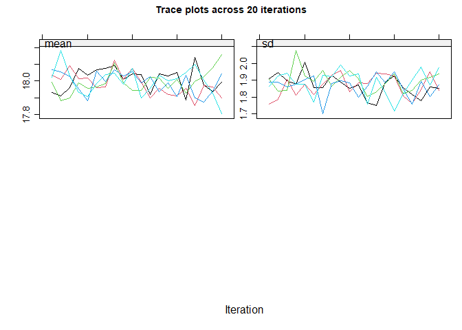

<!-- README.md is generated from README.Rmd. Please edit that file -->

# midoc

<!-- badges: start -->

[](https://github.com/elliecurnow/midoc/actions/workflows/R-CMD-check.yaml)
<!-- badges: end -->

## Overview

The Multiple Imputation DOCtor (`midoc`) R package is a guidance system
for analysis with missing data. It incorporates expert, up-to-date
methodology to help you choose the most appropriate analysis method when
there are missing data. By examining the available data and the assumed
causal structure, `midoc` will advise whether multiple imputation is
needed, and if so, how best to perform it.

- `descMissData` lists missing data patterns in the specified dataset

- `exploreDAG` compares the relationships in the available data with the
  proposed DAG

- `checkCRA` checks complete records analysis is valid under the
  proposed analysis model

- `checkMI` checks multiple imputation is valid under the proposed
  imputation model

- `checkModSpec` explores the parametric specification of the imputation
  model

- `proposeMI` suggests multiple imputation options based on the
  available data and specified imputation model

- `doMImice` performs multiple imputation based on the `proposeMI`
  options

You can learn more about these commands in `vignette("midoc","midoc")`.

## Installation

You can install the development version of midoc from
[GitHub](https://github.com/) with:

``` r
# install.packages("devtools")
devtools::install_github("elliecurnow/midoc")
```

## Usage

``` r
library(midoc)

head(bmi)
#>       bmi7      matage mated pregsize      bwt r
#> 1 15.16444 -1.30048035     0        0 3.287754 1
#> 2 18.00250 -0.33689915     0        0 3.770346 1
#> 3       NA -0.22673432     0        1 3.022161 0
#> 4       NA  0.81459107     1        0 3.103251 0
#> 5 17.97791 -0.55260086     0        0 3.830381 1
#> 6       NA -0.03829346     1        0 2.775282 0
```

``` r

descMissData(y="bmi7", covs="matage mated", data=bmi, plot=TRUE)
```


    #>  pattern bmi7 matage mated   n pct
    #>        1    1      1     1 592  59
    #>        2    0      1     1 408  41

``` r

exploreDAG(mdag=" matage -> bmi7 
                  mated -> matage 
                  mated -> bmi7 
                  sep_unmeas -> mated 
                  sep_unmeas -> r
                  pregsize -> bmi7 
                  pregsize -> bwt  
                  sep_unmeas -> bwt", 
           data=bmi)
#> The proposed directed acyclic graph (DAG) implies that the following 
#> pairs of variables are independent, or conditionally independent.  'X 
#> _||_ Y | Z' should be read as 'X is independent of Y conditional on Z'. 
#> Note that variable names are abbreviated: 
#> 
#> bmi7 _||_ bwt | prgs, sp_n
#> bmi7 _||_ bwt | matd, prgs
#> bmi7 _||_ r | sp_n
#> bmi7 _||_ r | matd
#> bmi7 _||_ sp_n | matd
#> bwt _||_ matg | matd
#> bwt _||_ matg | sp_n
#> bwt _||_ matd | sp_n
#> bwt _||_ r | sp_n
#> matg _||_ prgs
#> matg _||_ r | sp_n
#> matg _||_ r | matd
#> matg _||_ sp_n | matd
#> matd _||_ prgs
#> matd _||_ r | sp_n
#> prgs _||_ r
#> prgs _||_ sp_n
#> 
#> These (conditional) independence statements are explored below using 
#> the canonical correlations approach for mixed data. See 
#> ??dagitty::localTests for further details. 
#>  
#> Results are shown for variables that are fully observed in the 
#> specified dataset. 
#> The null hypothesis is that the stated variables are (conditionally) 
#> independent. 
#> 
#>                           estimate   p.value        2.5%      97.5%
#> bwt _||_ matage | mated 0.05018898 0.1127099 -0.01184095 0.11183410
#> matage _||_ pregsize    0.03029139 0.3386080 -0.03176134 0.09211150
#> matage _||_ r | mated   0.02998323 0.3435470 -0.03206946 0.09180567
#> mated _||_ pregsize     0.01594976 0.6144181 -0.04608889 0.07786585
#> pregsize _||_ r         0.01482015 0.6397174 -0.04721631 0.07674273
#> 
#>  Interpretation: A small p-value means the stated variables may not be 
#> (conditionally) independent in the specified dataset: your data may not 
#> be consistent with the proposed DAG.  A large p-value means there is 
#> little evidence of inconsistency between your data and the proposed DAG. 
#> 
#> Note that these results assume that relationships between variables are 
#> linear. Consider exploring the specification of each relationship in 
#> your model.  Also consider whether it is valid and possible to explore 
#> relationships between partially observed variables using the observed 
#> data, e.g. avoiding perfect prediction.
```

``` r

checkCRA(y="bmi7", covs="matage mated", r_cra="r",
         mdag="   matage -> bmi7 
                  mated -> matage 
                  mated -> bmi7 
                  sep_unmeas -> mated 
                  sep_unmeas -> r
                  pregsize -> bmi7 
                  pregsize -> bwt  
                  sep_unmeas -> bwt")
#> Based on the proposed directed acyclic graph (DAG), the analysis model 
#> outcome and complete record indicator are independent given analysis 
#> model covariates. Hence, complete records analysis is valid.
```

``` r

checkMI(dep="bmi7", preds="matage mated pregsize", r_dep="r",
        mdag="    matage -> bmi7 
                  mated -> matage 
                  mated -> bmi7 
                  sep_unmeas -> mated 
                  sep_unmeas -> r
                  pregsize -> bmi7 
                  pregsize -> bwt  
                  sep_unmeas -> bwt")
#> Based on the proposed directed acyclic graph (DAG), the incomplete 
#> variable and its missingness indicator are independent given imputation 
#> model predictors. Hence, multiple imputation methods which assume data 
#> are missing at random are valid in principle.
```

``` r

mimod_bmi7 <- checkModSpec(formula="bmi7~matage+I(matage^2)+mated+pregsize",
                           family="gaussian(identity)", data=bmi)
#> Model mis-specification method: regression of model residuals on a 
#> fractional polynomial of the fitted values 
#>  P-value: 1 
#> 
#> A large p-value means there is little evidence of model mis-specification.
```

``` r

miprop <- proposeMI(mimodobj=mimod_bmi7, data=bmi)
#> Based on your proposed imputation model and dataset, your mice() call 
#> should be as follows: 
#> mice(data =  bmi , 
#> # You may need to specify a subset of the columns in your dataset 
#>  
#> m =  41 , 
#> # You should use at least this number of imputations based on the 
#> proportion of complete records in your dataset 
#>  
#> method = c( 'norm' ) 
#> 
#> # Specify a method for each incomplete variable.  If displayed, the 
#> box-and-whisker plots can be used to inform your choice of method(s): 
#> for example, if the imputation model does not predict extreme values 
#> appropriately, consider a different imputation model/method e.g. PMM. 
#> Note the distribution of imputed and observed values is displayed for 
#> numeric variables only. The distribution may differ if data are missing 
#> at random. If you suspect data are missing not at random, the plots can 
#> also inform your choice of sensitivity parameter. 
#>  
#>  
#> formulas = formulas_list , # Note that you do not additionally need to 
#> specify a 'predmatrix' 
#>  
#> # The formulas_list specifies the conditional imputation models, as follows: 
#>  
#> 'bmi7 ~ matage + I(matage^2) + mated + pregsize' 
#>  
#> maxit = 10 , # If you have more than one incomplete variable, you 
#> should check this number of iterations is sufficient by inspecting the 
#> trace plots, if displayed.  Consider increasing the number of 
#> iterations if there is a trend that does not stabilise by the 10th 
#> iteration. Note that iteration is not required when only one variable 
#> is partially observed. 
#>  
#>  
#> printFlag = FALSE , # Change to printFlag=TRUE to display the history 
#> as imputation is performed 
#>  
#> seed = NA) # It is good practice to choose a seed so your results are 
#> reproducible
```



``` r

doMImice(miprop, 123, substmod="lm(bmi7 ~ matage + I(matage^2) + mated)")
#> Given the substantive model: lm(bmi7 ~ matage + I(matage^2) + mated) 
#>  
#> multiple imputation estimates are as follows: 
#> 
#>          term   estimate  std.error  statistic       df       p.value
#> 1 (Intercept) 17.6607324 0.07126548 247.816079 233.1668 2.116834e-284
#> 2      matage  1.1504545 0.05230345  21.995769 184.5081  1.863532e-53
#> 3 I(matage^2)  0.8414975 0.03231752  26.038433 257.1270  4.754845e-74
#> 4      mated1 -1.0026194 0.10787751  -9.294054 159.1101  1.094881e-16
#>        2.5 %     97.5 %
#> 1 17.5203258 17.8011389
#> 2  1.0472648  1.2536442
#> 3  0.7778567  0.9051382
#> 4 -1.2156760 -0.7895629
```
