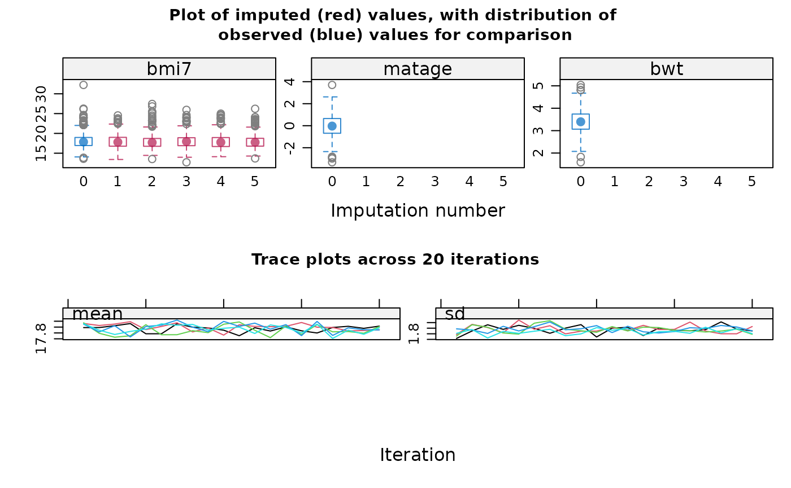

# Multiple Imputation DOCtor (midoc)

## About midoc

Missing data is a common issue in health and social research, often
addressed by multiple imputation (MI). MI is a flexible and general
approach, with a suite of software packages. However, using MI in
practice can be complex. Application of MI involves multiple decisions
which are rarely justified or even documented, and for which little
guidance is available.

The Multiple Imputation DOCtor (`midoc`) R package is a decision-making
system which incorporates expert, up-to-date guidance to help you choose
the most appropriate analysis method when there are missing data.
`midoc` will guide you through your analysis, examining both the
hypothesised causal relationships and the observed data to advise on
whether MI is needed, and if so how to perform it. `midoc` follows the
framework for the treatment and reporting of missing data in
observational studies (TARMOS)
[1](https://doi.org/10.1016/j.jclinepi.2021.01.008). We assume you are
interested in obtaining unbiased estimates of regression coefficients -
note that bias is not necessarily a concern if your interest is in
prediction (*i.e.* diagnostic/prognostic modelling).

Here, we will demonstrate the key features of `midoc` using a worked
example.

In this example, we wish to estimate the association between maternal
age at first pregnancy (our exposure) and child’s body mass index (BMI)
at age 7 years (our outcome). For simplicity, we only consider one
confounder of the relationship between maternal age and BMI at age 7
years, maternal education level. Note that simulated data for this study
are included in the `midoc` package in the `bmi` dataset. The dataset
contains 1000 observations, with realistic values for each variable, and
exaggerated relationships between variables (to highlight the
consequences of our choice of analysis approach).

**Note** An interactive version of this vignette: *Multiple Imputation
DOCtor (midoc) Shiny version* is also available to run locally (you can
run this using the `midoc` command
[`midocVignette()`](https://elliecurnow.github.io/midoc/reference/midocVignette.md)).
In the interactive version, you can apply features of `midoc` described
here using your own DAG and data.

You can also explore `midoc` functions interactively using the
(browser-based) [midoc Shiny
app](https://elliecurnow.shinyapps.io/midocshinyapp/).

## Step 1 Specify the analysis and missingness models using a directed acyclic graph

First, we will construct a causal diagram, or directed acyclic graph
(DAG) for our example, using syntax as per the
[dagitty](https://doi.org/10.1093/ije/dyw341) package.

We will start by specifying the relationships between our variables,
assuming there are no missing data.

We will assume maternal age (`matage`) causes BMI at age 7 years
(`bmi7`), and maternal education level (`mated`) causes both maternal
age and BMI at age 7 years. We can express these relationships using
“dagitty” syntax, as follows:

``` r
matage -> bmi7 
mated -> matage 
mated -> bmi7
```

Next, for each partially observed variable, we will specify the
variables related to its probability of being missing (its
“missingness”) by adding these relationships to our DAG. This type of
DAG is often referred to as a “missingness” DAG (mDAG)
[2](https://doi.org/10.1177/0962280210394469),
[3](https://doi.org/10.1093/ije/dyad008).

We will first use the `midoc` function `descMissData` to identify which
variables in our dataset are partially observed, specifying our outcome
(`y`), covariates, *i.e.* our independent variables, (`covs`), and
dataset (`data`), as follows.

``` r
descMissData(y="bmi7", 
             covs="matage mated", 
             data=bmi)
```

    [[1]]
         pattern bmi7 matage mated   n pct
    [1,]       1    1      1     1 592  59
    [2,]       2    0      1     1 408  41

We see that there are two missing data patterns: either all variables
are observed, or BMI at age 7 years is missing and all covariates are
observed. We will use indicator variable “R” to denote the missingness
of BMI at age 7 years (for example, R=1 if BMI at age 7 years is
observed, and 0 otherwise). In this specific example, R also indicates a
complete record (R=1 if all variables are fully observed, and 0
otherwise) because all other variables are fully observed. We will
suppose that R is related to maternal education level via socio-economic
position (SEP), *i.e.* SEP is a cause of both maternal education level
and R, but neither BMI at age 7 years itself nor maternal age are causes
of R. We will further suppose that SEP is missing (unmeasured) for all
individuals in our dataset; to remind us of this fact, we will name this
variable `sep_unmeas`.

Our mDAG is now as follows (note that we follow the convention of using
lower case names for variables in our code, so R becomes “r”, and so
on):

``` r
matage -> bmi7 
mated -> matage 
mated -> bmi7 
sep_unmeas -> mated 
sep_unmeas -> r
```

Note that if instead you believe maternal education is a direct cause of
R, the mDAG would be as follows:

``` r
matage -> bmi7 
mated -> matage 
mated -> bmi7 
mated -> r
```

We will now draw our mDAG and visually check that the relationships are
specified as we intended:

**Note** We have used additional commands to specify the layout of the
mDAG shown below - although this is not necessary when using `midoc`, go
to the dagitty [website](https://www.dagitty.net/) if you would like to
find out more about using “dagitty” to draw mDAGs.


As a final check of our mDAG, we will use the `midoc` function
`exploreDAG` to explore whether relationships in the dataset are
consistent with the proposed mDAG, specifying both our mDAG (`mdag`) and
dataset (`data`), as follows.

``` r
exploreDAG(mdag="matage -> bmi7 
                  mated -> matage 
                  mated -> bmi7 
                  sep_unmeas -> mated 
                  sep_unmeas -> r", 
           data=bmi)
```

    The proposed directed acyclic graph (DAG) implies the following pairs
    of variables are (conditionally) independent (where, for example, 'X
    _||_ Y | Z' should be read as 'X is independent of Y conditional on
    Z'). Note that variable names are abbreviated. Consider whether these
    (conditional) independencies are plausible for your study, and update
    your DAG accordingly:

    bmi7 _||_ r | sp_n

    bmi7 _||_ r | matd

    bmi7 _||_ sp_n | matd

    matg _||_ r | sp_n

    matg _||_ r | matd

    matg _||_ sp_n | matd

    matd _||_ r | sp_n

    These (conditional) independence statements are explored below using
    the canonical correlations approach for mixed data. See
    ??dagitty::localTests for further details.  Results are shown for
    variables that are fully observed in the specified dataset. The null
    hypothesis is that the stated variables are (conditionally)
    independent.

                            estimate  p.value        2.5%      97.5%

    matage _||_ r | mated 0.02998323 0.343547 -0.03206946 0.09180567

    Interpretation: A strong correlation means the stated variables may not
    be (conditionally) independent in the specified dataset: your data may
    not be consistent with the proposed DAG. A weak correlation means there
    is little evidence of inconsistency between your data and the proposed
    DAG.

    Note that there may also be other DAGs which your data are consistent
    with. Also note that these results assume that relationships between
    variables are linear. Consider exploring the specification of each
    relationship in your model.  Also consider whether it is valid and
    possible to explore relationships between partially observed variables
    using the observed data, e.g. avoiding perfect prediction.

Based on the relationships between fully observed variables maternal
age, maternal education, and missingness of BMI at age 7 years, we can
see that there is little evidence of inconsistency between our dataset
and proposed mDAG. In particular, our mDAG assumes that maternal age
(`matage`) is unrelated to missingness of BMI at age 7 years (`r`),
given maternal education (`mated`); our results suggest this is
plausible. Note that we cannot use our observed data to determine
whether BMI at age 7 years is unrelated to its own missingness - we
would need the missing values of BMI at age 7 years in order to do this.
However, if BMI at age 7 years was a cause of its own missingness, then
we would expect maternal age also to be related to its missingness (via
BMI at age 7 years). Since maternal age seems to be unrelated, we are
reassured that BMI at age 7 years is also likely to be unrelated, given
maternal education.

**Tips for specifying a “missingness” DAG**

- First specify the DAG for the analysis model, as it would be if there
  were no missing data. You may find this introduction to DAGs useful
  [4](https://doi.org/10.1038/s41390-018-0071-3).

- Next add missingness indicator(s) to your DAG. If you have multiple
  variables with missing data, you may want to start by including just
  the complete records indicator in your DAG.

- Identify variables related to missingness using:

  - Subject-matter knowledge, for example, prior research on causes of
    drop-out in your study and knowledge of the data collection process

  - Data exploration, for example, by performing a logistic regression
    of each missingness indicator on your analysis model variables -
    noting that you may have to exclude any variables with a large
    proportion of missing data to avoid perfect prediction

## Step 2 Check whether complete records analysis is likely to be a valid strategy

Our next step is to determine whether complete records analysis (CRA) is
a valid strategy, using our mDAG. Remember that, in general, CRA will be
valid if the analysis model outcome is unrelated to the complete records
indicator, conditional on the analysis model covariates
[5](https://doi.org/10.1093/ije/dyz032) (in special cases, depending on
the type of analysis model and estimand of interest, this rule can be
relaxed [6](https://doi.org/10.1093/aje/kwv114) - here, we will consider
the general setting without making any assumptions about the fitted
model).

Suppose we decide to estimate the unadjusted association between BMI at
age 7 years and maternal age, without including our confounder maternal
education in the model. We will use the `midoc` function `checkCRA`
applied to our mDAG to check whether CRA is valid for this model,
specifying our outcome (`y`), covariates, *i.e.* our independent
variables, (`covs`), complete records indicator (`r_cra`), and mDAG
(`mdag`), as follows:

``` r
checkCRA(y="bmi7", 
         covs="matage", 
         r_cra="r",
         mdag="matage -> bmi7 
               mated -> matage 
               mated -> bmi7 
               sep_unmeas -> mated 
               sep_unmeas -> r")
```

    Based on the proposed directed acyclic graph (DAG), the analysis model
    outcome and complete record indicator are not independent given
    analysis model covariates. Hence, in general, complete records analysis
    is not valid.

    In special cases, depending on the type of analysis model and estimand
    of interest, complete records analysis may still be valid. See, for
    example, Bartlett et al. (2015) (https://doi.org/10.1093/aje/kwv114)
    for further details.

    Consider using a different strategy e.g. multiple imputation, or a
    different analysis model, noting that a different analysis model may
    not be aligned with your estimand.

    For example, the analysis model outcome and complete record indicator
    are independent given each of the following sets of variables:

    mated

    c("matage", "mated")

    sep_unmeas

    c("matage", "sep_unmeas")

    c("mated", "sep_unmeas")

    c("matage", "mated", "sep_unmeas")

We can see that CRA would not be valid (we can also tell this by
inspecting our DAG: there is an open path from `bmi7` to `r` via `mated`
and `sep_unmeas` if we only condition on `matage`). `checkCRA` suggests
that CRA would be valid if we included `mated`, or `mated` and
`sep_unmeas`, in the analysis model. In this particular setting, it is
sensible to include `mated` in the analysis model since it is a
confounder of the relationship between `matage` and `bmi7`. In other
settings, we might not want to include the variables required for valid
CRA in our model because they might change its interpretation - in that
case, we would need to use a different analysis strategy. Note that
`sep_unmeas` is not related to `bmi7` once we condition on `mated`
(though it is still related to missingness of `bmi7`), so does not need
to be included in our analysis model.

If we add `mated` to the model and re-run `checkCRA`, as below, we see
that CRA is now valid.

``` r
checkCRA(y="bmi7", 
         covs="matage mated", 
         r_cra="r",
         mdag="matage -> bmi7 
               mated -> matage 
               mated -> bmi7 
               sep_unmeas -> mated 
               sep_unmeas -> r")
```

    Based on the proposed directed acyclic graph (DAG), the analysis model
    outcome and complete record indicator are independent given analysis
    model covariates. Hence, complete records analysis is valid.

**Note** If our outcome, BMI at age 7 years, was itself a cause of
missingness, CRA would always be invalid, *i.e.* there would be no other
variables we could add to the analysis model to make CRA valid. See
below to see the results of `checkCRA` in this case (note, in the code,
we have added a path from `bmi7` to `r` to the specified mDAG).

``` r
checkCRA(y="bmi7", 
         covs="matage mated", 
         r_cra="r",
         mdag="matage -> bmi7 
               mated -> matage 
               mated -> bmi7 
               sep_unmeas -> mated 
               sep_unmeas -> r 
               bmi7 -> r")
```

    Based on the proposed directed acyclic graph (DAG), the analysis model
    outcome and complete record indicator are not independent given
    analysis model covariates. Hence, in general, complete records analysis
    is not valid.

    In special cases, depending on the type of analysis model and estimand
    of interest, complete records analysis may still be valid. See, for
    example, Bartlett et al. (2015) (https://doi.org/10.1093/aje/kwv114)
    for further details.

    Consider using a different strategy e.g. multiple imputation.

## Step 3 Check whether multiple imputation is likely to be a valid strategy

Although CRA is valid for our example, we may also wish to perform MI.
Remember that MI is valid in principle if each partially observed
variable is unrelated to its missingness, given its imputation model
predictors. Furthermore, we should include all other analysis model
variables in the imputation model for each partially observed variable,
in the form implied by the analysis model, so that the analysis and
imputation models are “compatible”. In theory, given multiple partially
observed variables, validity of MI may imply different causes of
missingness for each missing data pattern. For example, if both BMI at
age 7 years and maternal education were partially observed, MI would
only be valid if missingness of BMI at age 7 years was unrelated to
maternal education among individuals missing both BMI at age 7 years and
maternal education (given the other observed data). Missingness of BMI
at age 7 years could be related to maternal education among individuals
with observed maternal education. In practice, we recommend focusing on
the most common missing data patterns and/or variables with the most
missing data. Less common missing data patterns can often be assumed to
be missing completely at random - it is unlikely to change your final
conclusions if this assumption is incorrect.

In our example, we only have a single partially observed variable (BMI
at age 7 years), so it is relatively simple to check the validity of MI
based on our mDAG. We have already verified (using `checkCRA`) that BMI
at age 7 years is unrelated to its missingness, given maternal age and
maternal education. Therefore, we know that MI will be valid if we use
only these variables in the imputation model for BMI at age 7 years
(because the analysis model and the imputation model are exactly the
same in this case). However, MI using just maternal age and maternal
education in the imputation model for BMI at age 7 years will recover no
additional information compared to CRA. Therefore, we may wish to
include “auxiliary variables” in our imputation model for BMI at age 7
years. These are additional variables that are included as predictors in
the imputation model but that are not required for the analysis model.
If we choose auxiliary variables that are predictive of BMI at age 7
years, we can improve the precision of our MI estimate - reduce its
standard error - compared to the CRA estimate.

In our example, we have two variables that could be used as auxiliary
variables: pregnancy size - singleton or multiple birth - (`pregsize`)
and birth weight (`bwt`). We will inspect the missing data patterns in
our dataset once again using `descMissData`, including our auxiliary
variables.

``` r
descMissData(y="bmi7", 
             covs="matage mated pregsize bwt", 
             data=bmi)
```

    [[1]]
         pattern bmi7 matage mated pregsize bwt   n pct
    [1,]       1    1      1     1        1   1 592  59
    [2,]       2    0      1     1        1   1 408  41

We can see that our auxiliary variables are fully observed.

We assume that pregnancy size is a cause of BMI at age 7 years, but not
its missingness. We assume birth weight is related to both BMI at 7
years (via pregnancy size) and its missingness (via SEP). We will now
add these variables to our mDAG. Below, we have shown our updated mDAG.


We will also once again explore whether relationships in the dataset are
consistent with the updated mDAG using `exploreDAG`, as follows.

``` r
exploreDAG(mdag="matage -> bmi7 
                  mated -> matage 
                  mated -> bmi7 
                  sep_unmeas -> mated 
                  sep_unmeas -> r 
                  pregsize -> bmi7 
                  pregsize -> bwt  
                  sep_unmeas -> bwt", 
           data=bmi)
```

    The proposed directed acyclic graph (DAG) implies the following pairs
    of variables are (conditionally) independent (where, for example, 'X
    _||_ Y | Z' should be read as 'X is independent of Y conditional on
    Z'). Note that variable names are abbreviated. Consider whether these
    (conditional) independencies are plausible for your study, and update
    your DAG accordingly:

    bmi7 _||_ bwt | prgs, sp_n

    bmi7 _||_ bwt | matd, prgs

    bmi7 _||_ r | sp_n

    bmi7 _||_ r | matd

    bmi7 _||_ sp_n | matd

    bwt _||_ matg | matd

    bwt _||_ matg | sp_n

    bwt _||_ matd | sp_n

    bwt _||_ r | sp_n

    matg _||_ prgs

    matg _||_ r | sp_n

    matg _||_ r | matd

    matg _||_ sp_n | matd

    matd _||_ prgs

    matd _||_ r | sp_n

    prgs _||_ r

    prgs _||_ sp_n

    These (conditional) independence statements are explored below using
    the canonical correlations approach for mixed data. See
    ??dagitty::localTests for further details.  Results are shown for
    variables that are fully observed in the specified dataset. The null
    hypothesis is that the stated variables are (conditionally)
    independent.

                              estimate   p.value        2.5%      97.5%

    bwt _||_ matage | mated 0.05018898 0.1127099 -0.01184095 0.11183410

    matage _||_ pregsize    0.03029139 0.3386080 -0.03176134 0.09211150

    matage _||_ r | mated   0.02998323 0.3435470 -0.03206946 0.09180567

    mated _||_ pregsize     0.01594976 0.6144181 -0.04608889 0.07786585

    pregsize _||_ r         0.01482015 0.6397174 -0.04721631 0.07674273

    Interpretation: A strong correlation means the stated variables may not
    be (conditionally) independent in the specified dataset: your data may
    not be consistent with the proposed DAG. A weak correlation means there
    is little evidence of inconsistency between your data and the proposed
    DAG.

    Note that there may also be other DAGs which your data are consistent
    with. Also note that these results assume that relationships between
    variables are linear. Consider exploring the specification of each
    relationship in your model.  Also consider whether it is valid and
    possible to explore relationships between partially observed variables
    using the observed data, e.g. avoiding perfect prediction.

Our results suggest that our updated mDAG is plausible.

Note that CRA is still valid for our updated mDAG. We can check this
using `checkCRA` once more:

``` r
checkCRA(y="bmi7", 
         covs="matage mated", 
         r_cra="r",
         mdag="matage -> bmi7 
               mated -> matage 
               mated -> bmi7 
               sep_unmeas -> mated 
               sep_unmeas -> r 
               pregsize -> bmi7 
               pregsize -> bwt  
               sep_unmeas -> bwt")
```

    Based on the proposed directed acyclic graph (DAG), the analysis model
    outcome and complete record indicator are independent given analysis
    model covariates. Hence, complete records analysis is valid.

We will now use the `midoc` function `checkMI` applied to our DAG to
check whether MI is valid when the imputation model predictors for BMI
at age 7 years include pregnancy size or birth weight, as well as
maternal age and maternal education. We will specify the partially
observed variable (`dep`), predictors (`preds`), missingness indicator
for the partially observed variable (`r_dep`), and mDAG (`mdag`).

We will first consider the imputation model including pregnancy size.
The results are shown below. These suggest that MI would be valid in
principle if we included pregnancy size as well as the other analysis
model variables in the imputation model for BMI at age 7 years.

``` r
checkMI(dep="bmi7", 
        preds="matage mated pregsize", 
        r_dep="r",
        mdag="matage -> bmi7 
              mated -> matage 
              mated -> bmi7 
              sep_unmeas -> mated 
              sep_unmeas -> r 
              pregsize -> bmi7 
              pregsize -> bwt  
              sep_unmeas -> bwt")
```

    Based on the proposed directed acyclic graph (DAG), the incomplete
    variable and its missingness indicator are independent given imputation
    model predictors. Hence, multiple imputation methods which assume data
    are missing at random are valid in principle.

We will next consider the imputation model including birth weight. The
results are shown below. These suggest that MI would not be valid if we
included birth weight as well as the other analysis model variables in
the imputation model for BMI at age 7 years. We can also tell this by
inspecting our mDAG: since `bwt` shares a common cause with both `bmi7`
and `r`, it is a “collider”, and hence conditioning on `bwt` opens a
path from `bmi7` to `r` via `bwt`.

``` r
checkMI(dep="bmi7", 
        preds="matage mated bwt", 
        r_dep="r",
        mdag="matage -> bmi7 
              mated -> matage 
              mated -> bmi7 
              sep_unmeas -> mated 
              sep_unmeas -> r 
              pregsize -> bmi7 
              pregsize -> bwt  
              sep_unmeas -> bwt")
```

    Based on the proposed directed acyclic graph (DAG), the incomplete
    variable and its missingness indicator are not independent given
    imputation model predictors. Hence, multiple imputation methods which
    assume data are missing at random are not valid.

    Consider using a different imputation model and/or strategy (e.g.
    not-at-random fully conditional specification).  For example, the
    incomplete variable and its missingness indicator are independent if
    each of the following sets of variables are used as predictors in the
    imputation model:

    mated

    c("matage", "mated")

    c("mated", "pregsize")

    c("bwt", "mated", "pregsize")

    c("matage", "mated", "pregsize")

    c("bwt", "matage", "mated", "pregsize")

    sep_unmeas

    c("bwt", "sep_unmeas")

    c("matage", "sep_unmeas")

    c("bwt", "matage", "sep_unmeas")

    c("mated", "sep_unmeas")

    c("bwt", "mated", "sep_unmeas")

    c("matage", "mated", "sep_unmeas")

    c("bwt", "matage", "mated", "sep_unmeas")

    c("pregsize", "sep_unmeas")

    c("bwt", "pregsize", "sep_unmeas")

    c("matage", "pregsize", "sep_unmeas")

    c("bwt", "matage", "pregsize", "sep_unmeas")

    c("mated", "pregsize", "sep_unmeas")

    c("bwt", "mated", "pregsize", "sep_unmeas")

    c("matage", "mated", "pregsize", "sep_unmeas")

    c("bwt", "matage", "mated", "pregsize", "sep_unmeas")

**Note** In theory, and as suggested by the `checkMI` results shown
above, MI would be valid if we added both birth weight and pregnancy
size as auxiliary variables in our imputation model (note that SEP is
not needed, conditional on the other imputation model predictors).
However, in practice, this strategy may still result in biased
estimates, due to unmeasured confounding of the relationship between BMI
at age 7 years and birth weight. We recommend not including colliders of
the partially observed variable and its missingness as auxiliary
variables [7](https://doi.org/10.3389/fepid.2023.1237447).

## Step 4 Check that all relationships are correctly specified

So far, we have explored whether CRA and MI are valid *in principle*
using our mDAG, without making any assumptions about the form of our
variables, or their relationships with each other.

However, for MI to give unbiased estimates, imputation models must be
both compatible with the analysis model and correctly specified: they
must contain all the variables required for the analysis model, they
must include all relationships implied by the analysis model
e.g. interactions, and they must specify the form of all relationships
correctly [8](https://doi.org/10.1016/j.jclinepi.2023.06.011).

Since CRA and MI are valid in principle for our worked example, we will
use the complete records in the `bmi` dataset to explore the
specification of relationships between BMI at age 7 years and its
predictors (the analysis model variables, maternal age and maternal
education, plus auxiliary variable, pregnancy size) in its imputation
model.

We will use the `midoc` function `checkModSpec` applied to the `bmi`
dataset to check whether our imputation model is correctly specified. We
will specify the formula for the imputation model using standard R
syntax (`formula`), the type of imputation model (`family`) (note that
`midoc` currently supports either linear or logistic regression models),
and the name of the dataset (`data`).

Since maternal education and pregnancy size are binary variables, we
only need to explore the form of the relationship between BMI at age 7
years and our continuous exposure, maternal age. We will first assume
there is a linear relationship between BMI at age 7 years and maternal
age (note, this is the default in most software implementations of MI).
We will assume there are no interactions.

The results are shown below. These suggest that our imputation model is
mis-specified. A plot of the residuals versus the fitted values from our
model (which is automatically displayed if there is evidence of model
mis-specification), suggests there may be a quadratic relationship
between BMI at age 7 years and maternal age.

``` r
checkModSpec(formula="bmi7~matage+mated+pregsize", 
             family="gaussian(identity)", 
             data=bmi)
```

    Method used to explore the relationship between the model residuals (y)
    and fitted values (fitvals): regression of model residuals on a
    fractional polynomial of the fitted values

    Call:

    glm(formula = y ~ ., family = family, data = data, weights = weights, 

        offset = offset, x = TRUE, y = TRUE)

    Coefficients:

                  Estimate Std. Error t value Pr(>|t|)    

    (Intercept) -5.908e-15  5.512e-02    0.00        1    

    fitvals.1   -5.268e-02  3.215e-03  -16.39   <2e-16 ***

    fitvals.2    1.629e-02  9.926e-04   16.41   <2e-16 ***

    ---

    Signif. codes:  0 '***' 0.001 '**' 0.01 '*' 0.05 '.' 0.1 ' ' 1

    (Dispersion parameter for gaussian family taken to be 1.798351)

        Null deviance: 1547.8  on 591  degrees of freedom

    Residual deviance: 1059.2  on 589  degrees of freedom

    AIC: 2032.4

    Number of Fisher Scoring iterations: 2

    Interpretation: A weak relationship between the model residuals and
    fitted values means there is little evidence of model
    mis-specification. A strong relationship between the model residuals
    and fitted values means the model may be mis-specified.

    Consider whether the specified model is plausible for your study, and
    update it accordingly.  Note that the observed relationships may be
    distorted by data missing not at random.


We will use the `midoc` function `checkModSpec` again, this time
specifying a quadratic relationship between BMI at age 7 years and
maternal age.

The results below suggest there is no longer evidence of model
mis-specification.

``` r
checkModSpec(formula="bmi7~matage+I(matage^2)+mated+pregsize", 
             family="gaussian(identity)", 
             data=bmi)
```

    Method used to explore the relationship between the model residuals (y)
    and fitted values (fitvals): regression of model residuals on a
    fractional polynomial of the fitted values

    Call:

    glm(formula = y ~ ., family = family, data = data, weights = weights, 

        offset = offset, x = TRUE, y = TRUE)

    Coefficients:

                  Estimate Std. Error t value Pr(>|t|)

    (Intercept) -3.409e-17  4.560e-02       0        1

    (Dispersion parameter for gaussian family taken to be 1.230712)

        Null deviance: 727.35  on 591  degrees of freedom

    Residual deviance: 727.35  on 591  degrees of freedom

    AIC: 1805.9

    Number of Fisher Scoring iterations: 2

    Interpretation: A weak relationship between the model residuals and
    fitted values means there is little evidence of model
    mis-specification. A strong relationship between the model residuals
    and fitted values means the model may be mis-specified.

    Consider whether the specified model is plausible for your study, and
    update it accordingly.  Note that the observed relationships may be
    distorted by data missing not at random.


**Note** We must make sure we account for the non-linear relationship
between BMI at age 7 years and maternal age in all other imputation
models. For example, the imputation model for pregnancy size would need
to include BMI at age 7 years, maternal education, and a quadratic form
of maternal age (induced by conditioning on BMI at age 7 years).
Although there are no missing values for pregnancy size in our dataset,
we can still explore the specification that we would need using
`checkModSpec` as follows (note that we have suppressed the plot in this
case using the `plot = FALSE` option):

``` r
checkModSpec(formula="pregsize~matage+bmi7+mated", 
             family="binomial(logit)",
             data=bmi, 
             plot=FALSE)
```

    Method used to explore the relationship between the model residuals
    (resp) and fitted values (fit): Pregibon's link test

    Call:

    glm(formula = resp ~ fit + fit2, family = binomial(link = "logit"), 

        data = newdat)

    Coefficients:

                Estimate Std. Error z value Pr(>|z|)    

    (Intercept)  0.47860    0.43221   1.107   0.2681    

    fit          1.58205    0.35739   4.427 9.57e-06 ***

    fit2         0.14532    0.07015   2.071   0.0383 *  

    ---

    Signif. codes:  0 '***' 0.001 '**' 0.01 '*' 0.05 '.' 0.1 ' ' 1

    (Dispersion parameter for binomial family taken to be 1)

        Null deviance: 422.18  on 591  degrees of freedom

    Residual deviance: 378.36  on 589  degrees of freedom

    AIC: 384.36

    Number of Fisher Scoring iterations: 6

    Interpretation: A weak relationship between the model residuals and
    fitted values means there is little evidence of model
    mis-specification. A strong relationship between the model residuals
    and fitted values means the model may be mis-specified.

    Consider whether the specified model is plausible for your study, and
    update it accordingly.  Note that the observed relationships may be
    distorted by data missing not at random.

There is some evidence of model mis-specification.

Once we include a quadratic form of maternal age in our model for
pregnancy size, there is little evidence of model mis-specification:

``` r
checkModSpec(formula="pregsize~matage+I(matage^2)+bmi7+mated", 
             family="binomial(logit)", 
             data=bmi)
```

    Method used to explore the relationship between the model residuals
    (resp) and fitted values (fit): Pregibon's link test

    Call:

    glm(formula = resp ~ fit + fit2, family = binomial(link = "logit"), 

        data = newdat)

    Coefficients:

                Estimate Std. Error z value Pr(>|z|)   

    (Intercept)  0.14518    0.38628   0.376  0.70703   

    fit          1.23212    0.42541   2.896  0.00378 **

    fit2         0.06609    0.11206   0.590  0.55536   

    ---

    Signif. codes:  0 '***' 0.001 '**' 0.01 '*' 0.05 '.' 0.1 ' ' 1

    (Dispersion parameter for binomial family taken to be 1)

        Null deviance: 422.18  on 591  degrees of freedom

    Residual deviance: 367.89  on 589  degrees of freedom

    AIC: 373.89

    Number of Fisher Scoring iterations: 6

    Interpretation: A weak relationship between the model residuals and
    fitted values means there is little evidence of model
    mis-specification. A strong relationship between the model residuals
    and fitted values means the model may be mis-specified.

    Consider whether the specified model is plausible for your study, and
    update it accordingly.  Note that the observed relationships may be
    distorted by data missing not at random.


**Tips for imputation model variable selection**

- The imputation model for each partially observed variable should
  include:

  1.  All analysis model variables - check that all relationships
      between the partially observed variable and its predictors are
      correctly specified in the imputation model *e.g.* using
      fractional polynomial selection

  2.  All auxiliary variables that are related to both missingness of
      the partially observed variable and the missing data itself,
      conditional on the analysis model variables

  3.  Auxiliary variables that are related to the missing data but not
      missingness of the partially observed variable, conditional on the
      variables selected in Steps 1 and 2 above - if there are a large
      number of such variables, only include the most predictive in the
      imputation model (using a suitable variable selection method to
      identify these)

- The imputation model for each partially observed variable should
  exclude:

  - All auxiliary variables that are related to missingness of the
    partially observed variable but not the missing data, conditional on
    the variables selected in Steps 1, 2, and 3 above

  - All auxiliary variables that are colliders of the partially observed
    variable and its missingness

## Step 5 Perform MI using the proposed imputation model

We have explored both the validity of MI in principle, using our mDAG,
and the specification of our imputation model, based on our observed
data. We will now use the `midoc` function `proposeMI` to choose the
best options when performing MI using the
[mice](https://doi.org/10.18637/jss.v045.i03) package. We will first
save our chosen imputation model (*i.e.* specifying a quadratic
relationship between BMI at age 7 years and maternal age) as a `mimod`
object. Note we have suppressed the `checkModSpec` message in this case
using the `message = FALSE` option. We will then use this, along with
our dataset, to construct our call of the “mice” function. Note we will
also save our proposed “mice” call as a `miprop` object, to be used
later.

The results are shown below. In particular, note that in the proposed
“mice” call, the default values for the number of imputations, method,
formulas, and number of iterations have been changed. Plots of the
distributions of imputed and observed data, based on a sample of five
imputed datasets, suggest that extreme values are handled appropriately
using the proposed imputation method. Trace plots, showing the mean and
standard deviation of the imputed values across iterations, are also
displayed. Note that both plots are shown without prompting
(`plotprompt = FALSE`). There is no need to adjust the number of
iterations when, as in our dataset, only one variable is partially
observed.

``` r
mimod_bmi7 <- checkModSpec(formula="bmi7~matage+I(matage^2)+mated+pregsize", 
                           family="gaussian(identity)", 
                           data=bmi,
                           message=FALSE)
```



``` r
miprop <- proposeMI(mimodobj=mimod_bmi7, 
                    data=bmi,
                    plotprompt=FALSE)
```

    Based on your proposed imputation model and dataset, your mice() call
    should be as follows:

    mice(data = bmi , # You may need to specify a subset of the columns in
    your dataset

    m = 41 , # You should use at least this number of imputations based on
    the proportion of complete records in your dataset

    method = c( 'norm' ) # Specify a method for each incomplete variable.
    If displayed, the box-and-whisker plots can be used to inform your
    choice of method(s): for example, if the imputation model does not
    predict extreme values appropriately, consider a different imputation
    model/method e.g. PMM. Note the distribution of imputed and observed
    values is displayed for numeric variables only. The distribution may
    differ if data are missing at random or missing not at random. If you
    suspect data are missing not at random, the plots can also inform your
    choice of sensitivity parameter.

    formulas = formulas_list , # Note that you do not additionally need to
    specify a 'predmatrix'

    # The formulas_list specifies the conditional imputation models, which
    are as follows:

    'bmi7 ~ matage + I(matage^2) + mated + pregsize'

    maxit = 10 , # If you have more than one incomplete variable, you
    should check this number of iterations is sufficient by inspecting the
    trace plots, if displayed. Consider increasing the number of iterations
    if there is a trend that does not stabilise by the 10th iteration. Note
    that iteration is not performed when only one variable is partially
    observed.

    printFlag = FALSE , # Change to printFlag=TRUE to display the history
    as imputation is performed

    seed = NA) # It is good practice to choose a seed so your results are
    reproducible


**Note** Given multiple partially observed variables, we can specify a
list of imputation models - one for each partially observed variable -
in `proposeMI`. For example, suppose pregnancy size was also partially
observed. We will assume, for simplicity, that pregnancy size was
missing completely at random. Then we could construct our proposed
“mice” call using `proposeMI`, as follows. Here, we again suppress the
model checking messages.

``` r
mimod_bmi7 <- checkModSpec(formula="bmi7~matage+I(matage^2)+mated+pregsize",
                           family="gaussian(identity)",
                           data=bmi,
                           message=FALSE)
mimod_pregsize <- checkModSpec(formula="pregsize~bmi7+matage+I(matage^2)+mated",
                               family="binomial(logit)",
                               data=bmi,
                               message=FALSE)
proposeMI(mimodobj=list(mimod_bmi7, mimod_pregsize), 
          data=bmi)
```

Returning to our example, we will assume no further adjustment is
required to the proposed “mice” call. We will use the `midoc` function
`doMImice` to perform MI, specifying our proposed “mice” call (`miprop`)
and the seed for our “mice” call (`seed`) (so that our results are
reproducible). We will also specify our substantive model of interest
(`substmod`): a regression of BMI at 7 years on maternal age (fitting a
quadratic relationship) and maternal education. This is an optional
step: if we specify the substantive model, it will be fitted
automatically to each imputed dataset and the pooled results will be
displayed (equivalent to using the “mice” functions `with` and `pool`).
If the substantive model is not specified, only the imputation step will
be performed.

``` r
doMImice(miprop, seed=123, substmod="lm(bmi7 ~ matage + I(matage^2) + mated)")
```

    Given the substantive model: lm(bmi7 ~ matage + I(matage^2) + mated) ,
    multiple imputation estimates are as follows:

             term   estimate  std.error  statistic       df       p.value

    1 (Intercept) 17.6607324 0.07126548 247.816079 233.1668 2.116834e-284

    2      matage  1.1504545 0.05230345  21.995769 184.5081  1.863532e-53

    3 I(matage^2)  0.8414975 0.03231752  26.038433 257.1270  4.754845e-74

    4      mated1 -1.0026194 0.10787751  -9.294054 159.1101  1.094881e-16

           2.5 %     97.5 %   conf.low  conf.high

    1 17.5203258 17.8011389 17.5203258 17.8011389

    2  1.0472648  1.2536442  1.0472648  1.2536442

    3  0.7778567  0.9051382  0.7778567  0.9051382

    4 -1.2156760 -0.7895629 -1.2156760 -0.7895629

## Illustration using our worked example

Finally, we illustrate how our choice of analysis approach affects the
estimated association between maternal age and BMI at age 7 years,
adjusted for maternal education level. We compare CRA and MI estimates.
When performing MI, we used either pregnancy size or birth weight as an
auxiliary variable and fitted either a linear or quadratic relationship
between BMI at age 7 years and maternal age in the imputation model. For
each analysis approach, we fitted the same substantive analysis model
that we used above.

The parameter estimates for the linear and quadratic terms of maternal
age, and their 95% confidence intervals, are shown in the table below.
Note that, because we have simulated the data and its missingness, we
know the “true” association *i.e.* the association if there were no
missing data - this is shown in the “Full data” row of the table.
Further note that the results displayed in the third row (“MI fitting
quadratic relationship, using pregnancy size”) are exactly those
generated above. To avoid repetition, we have not shown the code for
fitting the other models.

From the table, we can see that both CRA and MI (fitting a quadratic
relationship between BMI at age 7 years and maternal age in the
imputation model) estimates are unbiased for both the linear and
quadratic terms of maternal age. MI estimates are biased when fitting a
linear relationship in the imputation model, particularly for the
quadratic term of maternal age. MI estimates using the collider, birth
weight, as an auxiliary variable are slightly more biased and slightly
less precise than the estimates using pregnancy size as an auxiliary
variable. The collider bias is relatively small because the association
between BMI at age 7 years and maternal age is strong in this setting.
Note that the collider bias could be relatively larger if the
association was weak [9](https://doi.org/10.3389/fepid.2023.1237447).

| Approach                                                |   Linear term    |  Quadratic term  |
|:--------------------------------------------------------|:----------------:|:----------------:|
| Full data                                               | 1.17 (1.09-1.26) | 0.86 (0.80-0.91) |
| CRA                                                     | 1.16 (1.05-1.26) | 0.84 (0.77-0.90) |
| MI fitting quadratic relationship, using pregnancy size | 1.15 (1.05-1.25) | 0.84 (0.78-0.91) |
| MI fitting quadratic relationship, using birth weight   | 1.16 (1.05-1.27) | 0.83 (0.77-0.90) |
| MI fitting linear relationship, using pregnancy size    | 1.21 (1.07-1.34) | 0.54 (0.46-0.62) |
| MI fitting linear relationship, using birth weight      | 1.20 (1.07-1.34) | 0.53 (0.45-0.61) |

Parameter estimates for maternal age
